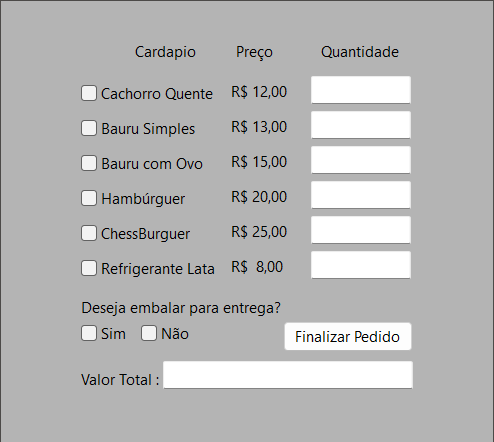

# Sistema de Pedido de Lanches

Este repositório contém um sistema para gerenciamento de pedidos de lanches, permitindo que os clientes selecionem itens do menu, especificando a quantidade e a opção de entrega.

## Funcionalidades

- **Seleção de Lanches**: Os clientes podem escolher entre várias opções de lanches.
- **Quantidade**: É possível definir a quantidade desejada de cada lanche.
- **Opção de Entrega**: O cliente pode optar por entrega, que adiciona uma taxa de R$4,00 ao valor total do pedido.

## Interface



## Como Usar

1. **Clone o Repositório**
   ```bash
   git clone 
